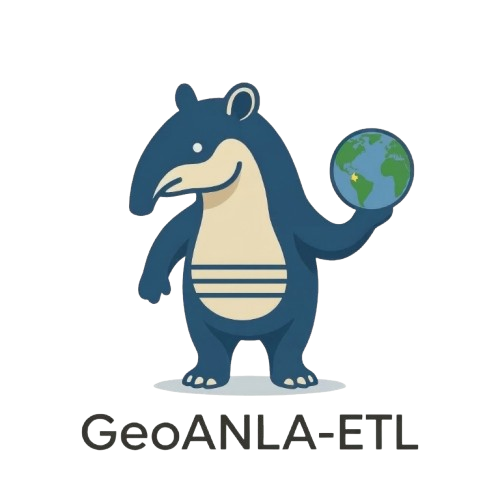

<div align="center">



# Validador Open Source de Datos Espaciales para el ANLA


*Herramienta colaborativa Open Source para la validación, estructuración y exportación de datos geográficos bajo el estándar de la Autoridad Nacional de Licencias Ambientales (ANLA) en Colombia.*

[](https://www.python.org/downloads/)
[](https://www.rust-lang.org/)
[](https://opensource.org/licenses/MIT)

</div>

---

## 📖 Sobre el Proyecto

**GeoANLA-ETL** nace de la necesidad imperativa de contar con un validador universal para las Geodatabases exigidas por la ANLA. Desarrollado bajo un esquema de código abierto, auditable y en continua optimización, el proyecto aplica los principios de la **Ingeniería y Ciencia de Datos** al cumplimiento ambiental.

Esta iniciativa busca reducir la brecha técnica entre profesionales, estandarizar buenas prácticas y democratizar el análisis y distribución de la información mediante el uso de software libre y tecnologías de última generación (como Python y el motor de Rust a través de Polars).

## 🔄 El Flujo de Trabajo (Arquitectura ETL)

El proyecto se fundamenta en un flujo robusto de Extracción, Transformación y Carga (ETL) que conecta el trabajo de campo con la entrega final estructural:

1. **Recolección Multidisciplinaria**: El ciclo inicia en campo con un equipo diverso (Biólogos, Geólogos, Topógrafos, Ingenieros) que captura la información primaria y la consolida en documentos y plantillas de datos.
2. **El Motor de Transformación**: Los datos crudos ingresan a un entorno de procesamiento alojado en GitHub, compuesto por tres núcleos:
   - ⚡ **Algoritmos**: Procesamiento ultrarrápido respaldado por tecnologías como **Polars** (Rust/Python).
   - 🛡️ **Validadores**: Reglas de negocio estrictas generadas por expertos (vía **Pydantic**) para garantizar la integridad topológica y alfanumérica comparando contra el catálogo oficial.
   - 🌐 **APIs**: Conexión en tiempo real con bases de datos globales (GBIF, CITES, UICN) para certificar la precisión taxonómica y de conservación.
3. **Empaquetado y Control Espacial**: El código genera un paquete de capas espaciales transformadas y limpias, listas para ser auditadas por el equipo SIG.
4. **Almacenamiento y Entrega**: Consolidación final de la información en formatos estándar universales (GeoPackage - GPKG) y propietarios (File Geodatabase - GDB), garantizando una entrega impecable a la autoridad ambiental (ANLA).

## 🎯 Objetivos e Impacto

- ⏱️ **Celeridad y Precisión**: Ahorra tiempo y recursos valiosos a los proyectos, filtrando y corrigiendo errores antes de que lleguen a la etapa de consolidación SIG.
- 🌉 **Reducción de Barreras**: Facilita la entrada de nuevos profesionales al complejo mundo del licenciamiento ambiental mediante herramientas automatizadas.
- ♾️ **Integrabilidad**: Entrega capas listas para ser utilizadas en múltiples propósitos, compatibles tanto con software libre (QGIS) como privativo (ArcGIS).
- 💡 **Innovación Continua**: Mantiene un repositorio vivo que fomenta la investigación, la integración de nuevas herramientas y el aprendizaje colaborativo en el mundo académico y de consultoría.

## 🛠️ Tecnologías Principales

- **[Polars](https://pola.rs/)**: Para un procesamiento ultrarrápido de los datos usando Rust bajo el capó.
- **[Pydantic](https://docs.pydantic.dev/)**: Validación robusta basada en esquemas y modelos definidos para cada tabla de datos (ej: `T_20_BIOTICO_CONTI_COSTE`, `T_23_ECONOMICO`, `T_34_COMPENSACION`).
- **[GeoPandas](https://geopandas.org/)**: Manejo y operaciones avanzadas de datos geoespaciales.
- **[FastExcel](https://github.com/ToucanToco/fastexcel) / [Pandas](https://pandas.pydata.org/)**: Soporte para lectura y escritura de múltiples formatos de entrada y reportes de error.
- **[Requests](https://pypi.org/project/requests/)**: Consultas a APIs externas de biodiversidad.

## 🚀 Instalación y Uso

Se requiere **Python 3.9+**.

```bash
git clone https://github.com/usuario/GeoANLA-ETL.git
cd GeoANLA-ETL
pip install .
```

*Nota: Revisa nuestra documentación de los modelos formales en `src/geoanla/models/` y las herramientas de validación geográfica en `src/geoanla/utils/`.*

## 🤝 Contribuir

¡Aceptamos aportes, Pull Requests y la apertura de Issues! Si deseas colaborar con la integración de nuevas validaciones (por ejemplo, sumando nuevas clases al modelo económico o biótico) o integrando módulos de exportación adicionales para formatos GDB, por favor lee [nuestra guía de contribución](CONTRIBUTING.md).
